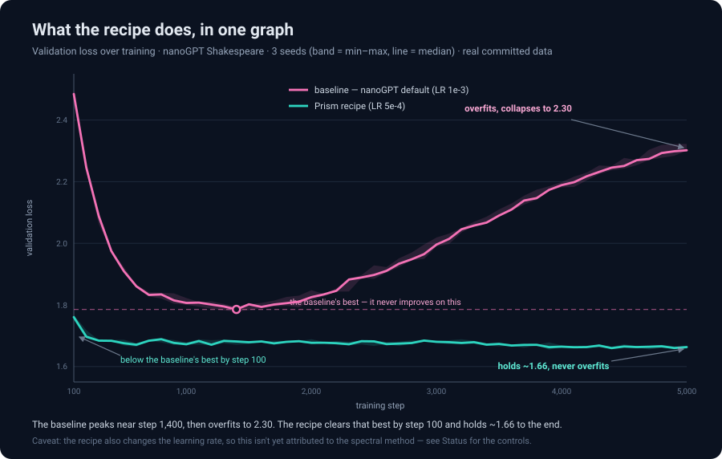
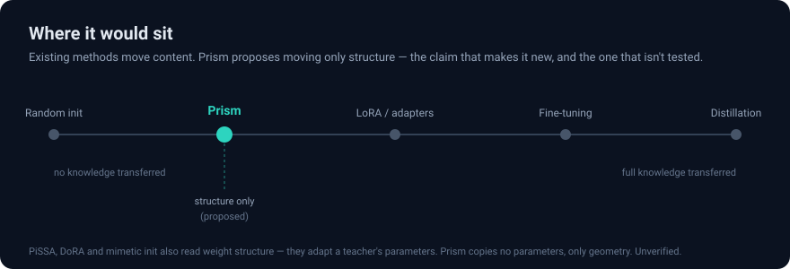
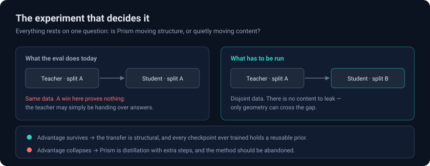

# Prism

**Hand a fresh model nothing but the *spectral geometry* of a trained one — no
weights, no data — and it stops overfitting.** On nanoGPT Shakespeare it reached,
in ~100 steps, the quality its baseline needed ~1,350 steps to hit, then kept
improving while the baseline overfit and fell apart. Three seeds, same story.

| nanoGPT Shakespeare, 5,000 steps | Baseline | Prism recipe |
|---|---|---|
| Best validation loss | 1.78 (@ ~1,350) | **1.66** |
| Loss at step 5,000 (where you'd actually stop) | **2.30 — overfit, collapsed** | **1.66 — stable** |
| Overfits within 5,000 steps | yes — all 3 seeds | **no — 0 of 3** |
| Steps to the baseline's best quality | ~1,350 | **≤100** |



The baseline peaks and then *rots* — its final loss (2.30) is far worse than its
own best (1.78). The recipe clears the baseline's best by the first checkpoint and
holds a floor the baseline never reaches at any point in training. **That regime
gap is the story;** the "~7% better best-vs-best" figure badly undersells it.

Every trained network learns two things: the weights (what it learned) and the
spectral geometry of those weights (how it organized itself to learn). Standard
practice keeps the first and bins the second. Prism keeps the second and hands it
to the next model.

> **The honest caveat, up front.** This compares the Prism *recipe config* to
> nanoGPT's *default config* — and the recipe also lowers the learning rate
> (1e-3 → 5e-4) and adds a regularizer. So the picture above is not yet creditable
> to the *spectral method*: a too-high baseline learning rate alone could produce
> it. One cheap control settles that, and it hasn't been run. The effect is real
> and reproducible; whether Prism is *why* is the open question. See
> [Status](#status) and [What's next](#whats-next).


## The idea

Take the SVD of a trained model's weights. You get two things: the **directions**
(which subspaces the model decided were worth using) and the **spectrum** (how
much energy it put in each). Together they describe the model's organization
without describing anything it knows.

Give both to a fresh model at init. Then, after every optimizer step, gently pull
it back toward that spectral shape. The student learns its own content from
scratch — Shakespeare, or whatever you point it at — but it doesn't spend its
first thousand steps rediscovering *how a transformer should be shaped*.

Three parts:

1. **Spectral Imprint** — compress the teacher's singular-value distribution to
   8 DCT coefficients per weight group (128 bytes total) and reshape the
   student's spectrum to match.
2. **EigenTransfer** — blend the student's singular vectors 75% toward the
   teacher's, then re-orthogonalize.
3. **Mod Wheel** — after each step, pull weights back toward the spectral target
   (strength 0.01, decay 0.9999).

No parameters are copied. Only geometry.



### How the imprint is derived

The Spectral Imprint is the compact half of the method — the part that fits in
128 bytes. SVD every trained weight matrix, normalize its singular values, and
average them within each weight group (attention, FFN up, FFN down, embedding).
Each group's averaged spectrum is a smooth, monotonically decaying curve — and a
smooth curve is exactly what a few cosine terms capture well. So the curve is
least-squares fit to **8 cosine (DCT) coefficients** in an inverse-softplus space
(which keeps the reconstruction positive). Those 8 numbers per group — ~128 bytes
total — softplus-reconstruct back to the spectrum, and the student's singular
values are reshaped to match.


The plot above is real, not illustrative: it overlays a group-averaged spectrum
against its reconstruction from 8 coefficients (mean absolute error ~0.03). Eight
numbers carry the shape; only the extreme low-energy tail drifts. That smoothness
is the whole reason the structure compresses so hard — and the caveat that
directional information (the U, V matrices) does *not* compress the same way is in
[Limitations](#limitations).

## Why it would matter

*These are motivations, not findings.*

**Training could become cumulative.** Today every run's organizational work dies
with it. If a spectral prior transfers, each run makes the next cheaper, and the
cost of a research program stops being linear in the number of runs.

**Overfitting might stop being the ceiling.** Overfitting is what ends most
training runs. A method that suppressed it would let you train longer, use bigger
models on smaller data, and shrink the regularization search. The honest caveat:
the mod wheel *is* a regularizer, and nobody has yet compared it against tuned
dropout and weight decay. Until that ablation exists, "it prevents overfitting"
is a description of what regularizers do, not a discovery.

**Late features would get time to arrive.** The representations that make models
good tend to emerge after the simple ones saturate. A model that overfits first
never gets them.

## The experiment that decides it

The whole method rests on one claim: that what transfers is *structure*, not
*content*. There is exactly one experiment that separates those, and it has not
been run.



As written, the eval trains the teacher and the student on the **same** 80%
split. A win there is unremarkable — the teacher may just be handing over
answers. Extract the fingerprint from one split, train the student on a disjoint
one, and the leak is closed: there is no shared content left, so anything that
survives is geometry.

If the advantage survives, that's a real result, and it implies every checkpoint
ever trained is sitting on a reusable prior nobody extracted. If it collapses,
Prism is distillation with extra steps and should be abandoned. Either way the
answer is worth having, which is the entire reason this repo is public.

## Status

There is now one committed result, and it is honest about its own limits.

**What's measured** (three seeds, one artifact:
[`results/recipe_20260718T002717Z.json`](results/recipe_20260718T002717Z.json),
nanoGPT Shakespeare, teacher 2000 steps, students 5000 steps, NVIDIA L4):

| | Baseline | Prism Recipe |
|---|---|---|
| Best val loss (median of 3) | 1.782 | **1.656** — ~7% lower |
| Val loss @ step 5000 | ~2.31 (overfit) | ~1.66 (stable) |
| Overfits within 5000 steps | yes — all 3 seeds | no — 0 of 3 |
| Steps to baseline's best quality | — | ≤100 (**≥13–14×**, lower bound) |

The effect holds on every seed. Full per-seed numbers and curves are in
[RESULTS.md](RESULTS.md) and the artifact. What it *means* is the open part:

**What's *not* settled — and it's the whole ballgame:**

- **The win isn't isolated to Prism.** The recipe doesn't differ from the baseline
  by only the spectral method — it also **halves the learning rate** (1e-3 → 5e-4),
  shortens warmup, and adds the mod wheel, which is itself a regularizer. The
  baseline's slide from ~1.78 to ~2.30 is exactly what too high a learning rate
  does on a tiny dataset over 5000 steps; a plain baseline at LR 5e-4 might not
  overfit and might reach ~1.66 on its own. Until a **schedule-matched control**
  (`prism_init=False` at the recipe's LR and warmup) is run, "Prism causes this"
  is unproven — it may just be the learning rate.
- **Even isolated, it'd be same-data.** Teacher and student share the 80% split, so
  a clean win still wouldn't distinguish structural transfer from the teacher
  leaking content. The [cross-data test](#the-experiment-that-decides-it) does that.
- **The speedup is a lower bound.** Prism crosses the baseline's best by the first
  eval (step 100), so 13–14× is left-censored — a floor, not a point estimate — and
  it's measured against that same, possibly LR-hobbled, baseline.

These knock down **in order**: the schedule-matched control first (does the
spectral method do *anything*?), then cross-data (is what it does *structural*?).

**What was withdrawn.** This repo previously headlined a **13x Prism Score**, val
losses **1.7704 / 1.6498**, and **71%** cross-data retention — none of which had a
committed artifact (they lived only in prose; every old run wrote to ephemeral
Colab paths, and seeds were never actually varied). Those numbers are gone. The
current 13–14× is the same *kind* of left-censored ratio as the old 13x, but now
it sits on committed curves and is labelled as a lower bound.

**The rule: a number in a doc must have a matching `results/*.json`.** The eval
enforces it — seeds are configurable, runs are multi-seed and resumable, scores
are flagged when left-censored, partial or crashed runs raise instead of being
scored, and every run writes curves + git commit + GPU + argv to
[`results/`](results/).

## Run it

**Modal (headless, recommended):** [`prism_modal.py`](prism_modal.py) runs the eval on a rented GPU with nothing to babysit — resumable across preemptions, streams logs, saves the artifact locally. `modal run --detach prism_modal.py`. The committed result was produced this way on an L4 in ~80 min for 3 seeds.

**Colab:** [open the eval →](https://colab.research.google.com/github/timepointai/nanogpt-prism-shakespeare/blob/master/nanogpt_prism_eval.ipynb) — resumable, streams progress, downloads an artifact at the end. Save the notebook with outputs. (Free-tier T4 is slow and disconnects; the notebook is built to survive that, but paid runtime finishes in one sitting.)

**Local:**
```bash
git clone https://github.com/timepointai/nanogpt-prism-shakespeare.git
cd nanogpt-prism-shakespeare/src
pip install torch numpy transformers tiktoken datasets
python prism_eval.py                     # seeds 1337,1338,1339
```

```bash
python prism_eval.py --seeds=1337        # one seed — a sample, not a result
python prism_eval.py --method=spectral_only   # ablation: 128-byte shape, no directions
python prism_eval.py --device=mps        # cuda | mps | cpu (auto-detected)
python prism_eval.py --report            # reprint the last artifact
```

Timing (measured): on an NVIDIA L4, a seed is ~27 min — teacher ~2.5 min, then
two 5000-step student runs at ~12 min each — so the default 3-seed run is ~80 min.
A free-tier T4 is much slower (~4 h/seed) and disconnects. The model is small
(10.65M params) and can't saturate a big GPU, so an A100/H100 buys little over an
L4. Each seed writes its artifact as it finishes, so a dropped runtime keeps
whatever completed. Commit the artifact alongside any claim you make.

### Reading a score

The Prism Score is `baseline_steps_to_best / method_steps_to_same_quality`.
It is a **ratio**, so read it next to `baseline_best` — a run whose baseline is
worse than another's produces a bigger score without a better method. That is
precisely how this repo talked itself into a 13x. A score marked `left_censored`
means the target was hit at the first eval and the true crossing is unresolved.

## What's next

**The experiment to run now: the endurance test.** The recipe hadn't overfit at
5,000 steps — so where is its ceiling? Take it to 20,000–50,000 steps and find the
step where validation loss stops falling and starts to rise, if it ever does.
Either outcome is worth having:

- **It holds** (or keeps descending): direct evidence that the mod wheel *removes*
  the overfitting ceiling rather than merely postponing it — the boldest claim in
  this repo, tested head-on.
- **It destabilizes at step N**: then N is a real, measured number — the actual
  ceiling — and that is publishable too.

Run a **schedule-matched baseline** (`prism_init=False` at LR 5e-4) in the *same*
job, and the endurance run does double duty — it also settles attribution: if the
matched baseline holds the floor too, the effect was the learning rate; if only the
recipe holds, the spectral method is doing something real.

The clean way to remove the confound is not a separate control but to run the
recipe at the baseline's *own* learning rate, so the two arms differ by nothing
but the spectral flags. The eval supports it directly:

```bash
python prism_eval.py --method_lr=1e-3 --method_warmup=100   # recipe at baseline's schedule
python prism_eval.py --baseline_lr=5e-4 --baseline_warmup=50  # + baseline at recipe's LR → full 2×2
```

If the recipe still holds ~1.66 and doesn't overfit at LR 1e-3 — where the
baseline collapses — the effect is Prism, not the schedule. If it overfits too,
the learning rate was doing the work. (One honest limit: a single shared LR is one
point; the airtight version compares each arm at *its own best* LR, a small sweep.)

After that, in order:

1. **Attribution** — the matched-schedule run above. Nothing else counts until the
   effect survives with the spectral method as the *only* difference from the
   baseline.
2. **Cross-data** — fingerprint from one half of the data, student on the disjoint
   other half. Separates structural transfer from content leakage; only meaningful
   once attribution holds.
3. **Scale** — GPT-2 124M on OpenWebText: the first honest test against real data.

(Multi-seed is already done — the committed result is three seeds, range published,
not the best seed.)

## Limitations

- **Not attributed to the method.** The recipe changes the learning rate and adds
  a regularizer on top of the spectral transfer, so the committed result may be the
  schedule, not Prism. No schedule-matched control has been run. This supersedes
  everything else here.
- **Same-data only.** Even with a clean control, teacher and student share the
  split, so it would not exclude content leakage.
- **Cross-data untested** — the experiment that separates structure from leakage.
- **Shakespeare only** — char-level, ~1M tokens, 10.65M params.
- **A teacher is required.** Prism is transfer learning, not magic.
- **The 128-byte headline is not the method.** 128 bytes is the spectrum; the
  directions that appear to do the real work are ~500 MB. Compressing them is an
  open problem, and until it's solved the compression framing oversells.

## Repo map

```
README.md                  ← you are here
WHITEPAPER.md              ← method in full + the committed result and its caveats
RESULTS.md                 ← the committed 3-seed result and what it does/doesn't show
results/                   ← eval artifacts. the evidence. one committed 3-seed run
nanogpt_prism_eval.ipynb   ← multi-seed Colab eval, writes a committable artifact
src/prism_eval.py          ← the benchmark
src/prism_init.py          ← Spectral Imprint + EigenTransfer + Mod Wheel
src/prism_extract.py       ← extract a fingerprint from any checkpoint
experiments/               ← exploratory notebooks, saved without outputs (not evidence)
```

## License

MIT — see [LICENSE](LICENSE).

A standalone clone of [nanoGPT](https://github.com/karpathy/nanoGPT) by Andrej
Karpathy (MIT, © 2022), not a fork. `model.py`, `configurator.py`, `bench.py`,
`sample.py`, and the `data/` preparers are his; `train.py` is his with Prism
hooks added. The Prism code (`prism_init.py`, `prism_extract.py`,
`prism_eval.py`, `config/prism_*.py`) is Timepoint Labs', under the same terms.

---

*A [Timepoint Labs](https://timepointai.com) project by [Sean McDonald](https://x.com/seanmcdonaldxyz).*
